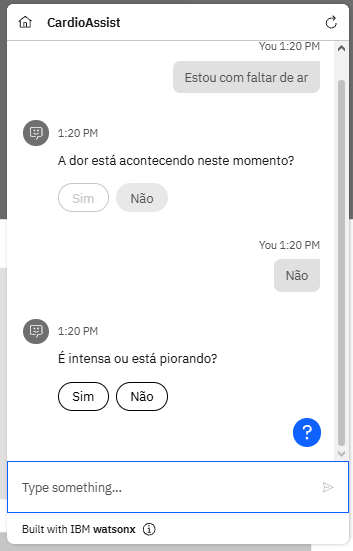
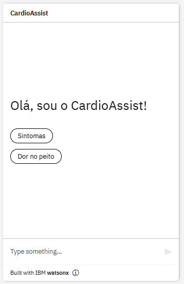
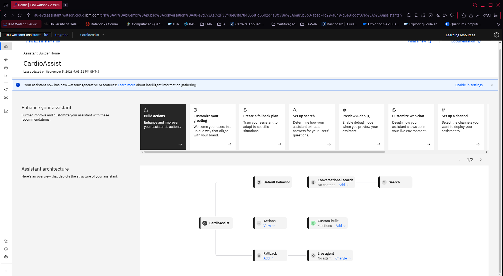

# FIAP - Faculdade de Informática e Administração Paulista

<p align="center">
<a href= "https://www.fiap.com.br/"></a>
</p>

<br>

# Fase 5 - Assistente Cardiológico Inteligente: Experiência do Paciente

## Autor: 
- <a href="https://www.linkedin.com/in/renanmendes26/">Renan de Oliveira Mendes - RM563145</a>

# CardioAssist — Chat com IBM Watson Assistant

O **CardioAssist** é um assistente virtual mobile para orientação inicial sobre saúde cardiovascular, construído com:

- **Backend Python (Flask)** em `Backend/` — integra a API do **IBM watsonx Assistant v2** (criação e reutilização de sessão, tratamento de erros/timeouts e CORS para o app).
- **App mobile em React Native / Expo** em `CardioAssist/` — interface de chat simples, moderna e responsiva, com estado de carregamento, indicador de digitação, sugestões rápidas e tratamento amigável de erros.

  

### Como executar

#### 1. Backend (API Flask)

```powershell
cd "c:\Users\Pichau\OneDrive\Área de Trabalho\Fase5_CardioAssist\Backend"
pip install -r requirements.txt
python app.py
```

O servidor sobe em `http://localhost:5000`.

- `GET  /health` → estado do serviço e da configuração com Watson.
- `POST /api/chat` → envio de mensagem: `{ "message": "...", "session_id": "..." }`.

As credenciais do Watson ficam em `Backend/IBM_API.py` e podem ser sobrescritas no arquivo `.env` (veja `Backend/.env.example`).

#### 2. App (Expo)

```powershell
cd "c:\Users\Pichau\OneDrive\Área de Trabalho\Fase5_CardioAssist\CardioAssist"
npm install
npx expo start
```

| Ambiente | URL do backend |
|---|---|
| Web / iOS simulador | `http://localhost:5000` (automático) |
| Emulador Android | `http://10.0.2.2:5000` (fallback automático) |
| Celular físico | `http://<IP-da-máquina>:5000` (**detectado automaticamente** pelo host do Metro) |

O app detecta o IP do servidor do Expo (`exp://...`) e usa a mesma máquina na porta `5000`, então em **celular físico não é preciso configurar nada**. Se precisar sobrescrever manualmente (ex.: backend em outra máquina), crie um `.env` na raiz do app:

```
EXPO_PUBLIC_API_URL=http://192.168.15.16:5000
```

>  **Dica de firewall**: se o celular não conectar, libere a porta 5000 no Windows:
> ```powershell
> netsh advfirewall firewall add rule name="CardioAssist 5000" dir=in action=allow protocol=TCP localport=5000
> ```

### Estrutura

```
Fase5_CardioAssist/
├── Backend/
│   ├── app.py           # API Flask (GET /health e POST /api/chat)
│   ├── IBM_API.py       # Cliente e credenciais do IBM Watson Assistant
│   ├── requirements.txt
│   └── .env.example     # Modelo para sobrescrever credenciais
└── CardioAssist/        # App Expo (React Native)
    ├── App.js
    ├── .env.example     # Modelo para EXPO_PUBLIC_API_URL
    └── src/
        ├── constants/api.js       # Detecção da URL do backend
        ├── services/watsonApi.js  # Chamadas HTTP com timeout e erros amigáveis
        ├── theme.js               # Paleta, tipografia e espaçamentos
        ├── components/            # ChatHeader, MessageBubble, ChatInput,
        │                          # TypingIndicator e ErrorBanner
        └── screens/ChatScreen.js  # Tela principal do chat
```

---

# Descrição
Nessa quarta fase aprofundamos em visão computacional, por meio de modelos de redes neurais convulacionais CNNs. Usando um notebook python e um dataset de imagens de raio-x, pré-processamos e treinamos dois modelos, um CNN do zero e um modelo de MobileNetV2 - Transfer Learning.

Também realizamos uma análise de vieses do dataset e do desbalanceamento identificado.

Indo além, criei uma aplicação mobile moderna com React Native, permitindo o envio e classificação de imagens de raio-x. 

## Links Videos:
### Parte 1 e Parte 2: 
### Ir Além: https://youtu.be/1NBNX88V1-0
### App: https://youtube.com/shorts/XTpQ_kAq_G8


# Parte 1
Usando o dataset "Chest X-Ray Images (Pneumonia)" com mais de cinco mil imagens, criei um pipeline onde realizei técnicas de pré-processamento, como redimensionamento, normalização e data augmentation.

dataset: https://www.kaggle.com/datasets/paultimothymooney/chest-xray-pneumonia

O dataset Chest X-Ray Pneumonia disponível publicamente no Kaggle. O conjunto contém imagens classificadas em duas categorias:

- Normal
- Pneumonia

As imagens já se encontram separadas em conjuntos de treinamento, validação e teste.


Para Pré-Processamento as etapas realizadas foram:

- Redimensionamento das imagens para 128 pixels.
- Normalização dos pixels para o intervalo entre 0 e 1.
- Aplicação de técnicas de aumento de dados (rotação, zoom e espelhamento horizontal).
- Organização dos dados em conjuntos de treinamento, validação e teste.


Redimensionei as imagens para escalas de (128,128) para facilitar o treinamento, diminuindo as escalas. A normalização acelera o treinamento e melhora a convergência. O aumento de dados reduz overfitting e melhora a capacidade de generalização do modelo.


Durante a análise do dataset foi identificado um desbalanceamento entre as classes. O conjunto de treinamento contém 1.341 imagens classificadas como Normal e 3.875 imagens classificadas como Pneumonia. Esse cenário pode introduzir viés no treinamento do modelo, favorecendo a classe majoritária. Para mitigar esse problema foi usada técnicas como data augmentation e ponderação de classes durante o treinamento.


# Parte 2

Seguindo, no mesmo notebook python realizamos as seguintes etapas:

- Treinamento de uma CNN simples.
- Treinamento de uma CNN com Transfer Learning.
- Comparação dos resultados.
- Interface para classificação.

Foram implementadas duas abordagens para classificação de imagens médicas: uma CNN construída do zero e um modelo de transfer learning utilizando MobileNetV2.

O modelo CNN desenvolvido do zero possui 3.304.769 parâmetros distribuídos em 10 camadas. É composto por três camadas convolucionais (Conv2D) para extração de características, três camadas de Max Pooling para redução da dimensionalidade, uma camada Flatten para transformar em um vetor unidimensional, uma camada Dropout para reduzir o risco de overfitting e duas camadas densas (Dense) responsáveis pela classificação final. As funções de ativação utilizadas foram ReLU e Sigmoid na camada de saída, usadas para problemas de classificação binária.


O modelo MobileNetV2 foi escolhido por apresentar uma arquitetura mais leve em comparação com outros modelos utilizados em Transfer Learning, como VGG16 e ResNet. 
Apesar de possuir aproximadamente 3,5 milhões de parâmetros, esse número é menor do que o de arquiteturas mais complexas, permitindo tempos de treinamento reduzidos, além de menor consumo de memória. Essas características tornam o modelo especialmente adequado para aplicações com recursos computacionais limitados e para protótipos que exigem boa precisão aliada a desempenho eficiente.


 Devido ao desbalanceamento do dataset (25,71% Normal e 74,29% Pneumonia), foi aplicada ponderação de classes durante o treinamento. 


### Pré-requisitos

- Python 3.10+ (venv já incluído em `venv/`)
- Node.js 18+
- [Expo Go](https://expo.dev/go) no celular **ou** emulador Android/iOS

---

### 1. Iniciar o backend (API)

Abra um terminal na pasta do projeto:

```powershell
cd "c:\Users\Pichau\OneDrive\Área de Trabalho\Fase_4_Cap1\Ir_Alem2\backend"
```

Ative o ambiente virtual e inicie o servidor:

```powershell
..\venv\Scripts\Activate.ps1
python app.py
```

O servidor ficará disponível em `http://localhost:5000`.

Teste rápido no navegador ou PowerShell:

```powershell
Invoke-RestMethod http://localhost:5000/health
```

Deve retornar: `{"status":"ok","model":"mobilenet_pneumonia.keras"}`

---

### 2. Iniciar o app (Expo)

Abra **outro terminal**:

```powershell
cd "c:\Users\Pichau\OneDrive\Área de Trabalho\Fase_4_Cap1\Ir_Alem2\cardio-assistant"
npm install
npx expo start
```

Opções após o Expo iniciar:

| Plataforma | Como abrir |
|------------|------------|
| **Web** | Pressione `w` no terminal |
| **Android emulador** | Pressione `a` (requer Android Studio) |
| **Celular físico** | Escaneie o QR code com Expo Go |

---

### 3. Configurar URL do servidor

O app detecta automaticamente:

| Ambiente | URL padrão |
|----------|------------|
| Web / iOS simulador | `http://localhost:5000` |
| Emulador Android | `http://10.0.2.2:5000` |
| Celular físico | Precisa do IP da sua máquina na rede Wi-Fi |


### Fluxo de uso

1. Backend rodando (`python app.py`)
2. App aberto no Expo
3. Aba **Análise** → **Selecionar Imagem** → **Analisar**
4. Resultado: `Normal` ou `Pneumonia` + confiança (%)

---


### Estrutura

```
├── backend/
│   ├── app.py
│   ├── mobilenet_pneumonia.keras
│   └── requirements.txt
├── cardio-assistant/
│   ├── app/              # Rotas Expo Router
│   ├── screens/          # Tela principal de análise
│   └── constants/api.ts  # URL da API
└── venv/                 # Ambiente Python
```

